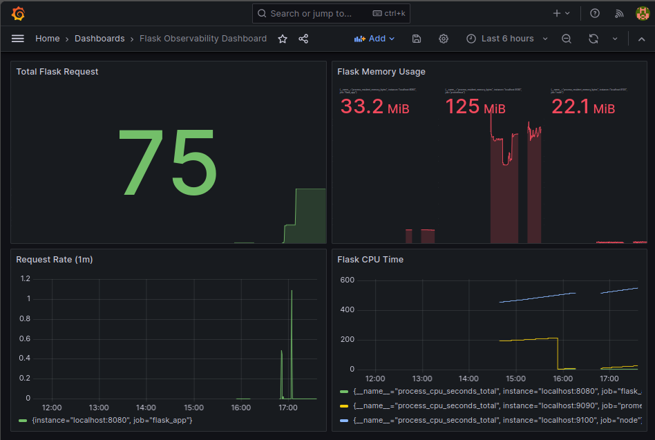

# 🐳 Flask Container Lab


---

# 📌 Overview
This project demonstrates the deployment of a multi-container Flask application using Podman and nginx on Fedora Linux.

The environment now includes Prometheus-compatible application metrics, enabling observability and future monitoring integration with Prometheus and Grafana.

The lab focuses on:
This project demonstrates the deployment of a containerized Flask application using Podman and nginx on Fedora Linux.

The application has been instrumented with Prometheus metrics and integrated with Prometheus and Grafana to provide end-to-end observability.

The lab focuses on:

- Containerized application deployment
- Reverse proxy configuration
- Internal container networking
- Application instrumentation
- Metrics exposure for observability
- Podman Compose orchestration
- Metrics collection and monitoring
- Observability workflows
- CI automation with GitHub Actions

---

# ✨ Current Functionality

* Multi-container deployment
* Reverse proxy communication
* Internal container networking
* Containerized Flask application
* Prometheus-compatible metrics exposure
* HTTP request monitoring
* Declarative orchestration with Compose
* Local web application hosting
- Multi-container deployment
- Reverse proxy communication
- Internal container networking
- Containerized Flask application
- Prometheus-compatible metrics exposure
- Prometheus metrics scraping
- Grafana dashboard visualization
- HTTP request monitoring
- Declarative orchestration with Compose
- Local web application hosting

---

# 🧠 Key Concepts Demonstrated

- Linux container workflows
- Reverse proxy configuration
- Container networking
- Multi-container orchestration
- Service isolation
- Application instrumentation
- Prometheus monitoring
- Grafana observability
- CI/CD fundamentals
- Web application deployment

---

# 🏗️ Architecture

```text
Client Browser
      │
      ▼
nginx Reverse Proxy Container
      │
      ▼
Flask Application Container
      │
      ├── Application Responses
      │
      └── /metrics Endpoint
               │
               ▼
     Prometheus-Compatible Metrics
          Prometheus
               │
               ▼
            Grafana

Internal Podman Network
```

## Traffic Flow

1. Client requests arrive through nginx on port 8080
2. nginx forwards requests to the Flask application container
3. Flask processes application requests and returns responses
4. Flask exposes Prometheus-compatible metrics through `/metrics`
5. Containers communicate through an isolated internal Podman network
3. Flask processes requests and returns responses
4. Flask exposes Prometheus metrics through `/metrics`
5. Prometheus scrapes and stores metrics
6. Grafana visualizes metrics through dashboards
7. Containers communicate through an isolated Podman network

---

# ⚙️ Continuous Integration

This project includes a GitHub Actions workflow that automatically:

- Checks out repository code
- Installs Python dependencies
- Verifies Flask package availability
- Validates repository changes on push

The CI pipeline helps ensure consistency and reliability throughout development.

---

# 📸 Deployment Verification

### Running Containers


### Application Response


### Curl Test


---

# 📸 Prometheus & Grafana Observability

### Flask Metrics Dashboard



---

# 📈 Metrics Integration

The application exposes Prometheus-compatible metrics through:

```text
http://127.0.0.1:8080/metrics
```

Metrics currently include:

- HTTP request counters
- Python runtime metrics
- Process memory metrics
- Process CPU metrics
- Application request monitoring

Example custom metric:

```text
flask_app_requests_total
```

Prometheus collects these metrics and stores them as time-series data.

Grafana visualizes the collected metrics to provide real-time insight into application behavior and performance.

---

# 📂 Project Structure

```text
flask-container-lab/
├── app/
│   ├── app.py
│   └── requirements.txt
├── nginx/
│   └── default.conf
├── screenshots/
├── .github/
│   └── workflows/
│       └── python-ci.yml
├── Containerfile
├── compose.yaml
└── README.md
```

---

# 🚀 Getting Started

## Clone Repository

```bash
git clone https://github.com/sgill3077/flask-container-lab.git
cd flask-container-lab
```

## Build and Start Containers

```bash
podman compose up --build
```

## Access Application

```text
http://127.0.0.1:8080
```

## View Metrics

```text
http://127.0.0.1:8080/metrics
```

## Stop Containers

```bash
podman compose down
```

---

# 🛠️ Tech Stack

- Python 3
- Flask
- Podman
- Podman Compose
- nginx
- Prometheus
- Grafana
- GitHub Actions
- Fedora Linux

---

# 📚 Lessons Learned

Through this project I gained practical experience with:

- Configuring nginx as a reverse proxy
- Building multi-container applications
- Debugging container networking issues
- Managing Podman-based deployments
- Implementing Prometheus instrumentation
- Collecting and visualizing metrics
- Working with Grafana dashboards
- Creating CI workflows with GitHub Actions
- Building reproducible deployment environments

The project also improved my understanding of service communication and infrastructure troubleshooting in containerized environments.

---

# 📈 Prometheus Metrics Integration

The Flask application now exposes Prometheus-compatible metrics through:

```text
/metrics
```

Example endpoint:

```text
http://127.0.0.1:8080/metrics
```

Current metrics include:

* HTTP request counters
* Python runtime metrics
* Process-level metrics

This instrumentation enables future integration with Prometheus and Grafana for observability and monitoring workflows.
The project significantly improved my understanding of containerized applications, monitoring, and observability practices.

---

# 🔧 Future Improvements

* Add persistent logging volumes
* Implement container health checks
* Integrate SSL/TLS support
* Integrate Prometheus scraping and Grafana dashboards
* Expand CI/CD automation workflows
* Deploy to a cloud-hosted Linux VM
- Add persistent logging volumes
- Implement container health checks
- Add SSL/TLS support
- Expand CI/CD workflows
- Add automated testing
- Deploy to a cloud-hosted Linux VM
- Implement alerting with Alertmanager

---

# 🔗 GitHub Repository

Repository:

https://github.com/sgill3077/flask-container-lab
