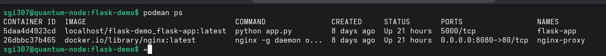
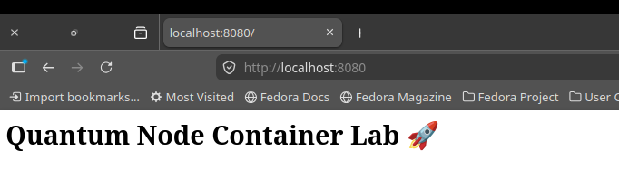
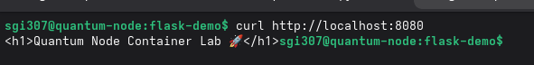

# 🐳 Flask Container Lab


---

# 📌 Overview

This project is a containerized Flask web application platform deployed with Podman Compose and nginx on Fedora Linux.

The environment simulates a production-style multi-container deployment workflow, including:

* Reverse proxy routing with nginx
* Internal container networking
* Multi-container orchestration with Podman Compose
* Isolated application services
* Linux-based deployment workflows
* Continuous Integration with GitHub Actions

This project was built to strengthen practical DevOps and infrastructure engineering skills around containerization, service communication, and application deployment.

---

# ✨ Current Functionality

* Multi-container deployment
* Reverse proxy communication
* Internal container networking
* Containerized Flask application
* Declarative orchestration with Compose
* Local web application hosting
* Automated CI workflow validation

---

# 🧠 Key Concepts Demonstrated

* Linux container workflows
* Reverse proxy configuration
* Container networking
* Multi-container orchestration
* Service isolation
* Declarative infrastructure configuration
* CI/CD fundamentals
* Web application deployment

---

# 🏗️ Architecture

```text
Client Browser
      │
      ▼
nginx Reverse Proxy Container
      │
      ▼
Flask Application Container
      │
Internal Podman Network
```

## Traffic Flow

1. Client requests arrive through nginx on port 8080
2. nginx forwards requests to the Flask application container
3. Flask processes the request and returns the response
4. Containers communicate through an isolated internal Podman network

---

# ⚙️ Continuous Integration

This project includes a GitHub Actions CI workflow that automatically:

* Validates Python dependencies
* Installs application requirements
* Runs verification checks
* Validates repository changes on push and pull requests

The CI pipeline helps ensure deployment consistency and improves development workflow reliability.

---

# 📸 Deployment Verification

## Running Containers



## Application Response



## Curl Test



---

# 📂 Project Structure

```text
flask-container-lab/
├── app/
│   ├── app.py
│   └── requirements.txt
├── nginx/
│   └── default.conf
├── screenshots/
├── .github/workflows/
├── Containerfile
├── compose.yaml
└── README.md
```

---

# 🚀 Getting Started

## Clone the Repository

```bash
git clone https://github.com/sgill3077/flask-container-lab.git
cd flask-container-lab
```

## Build and Start Containers

```bash
podman compose up --build
```

## Open in Browser

```text
http://127.0.0.1:8080
```

## Stop Containers

```bash
podman compose down
```

---

# 🛠️ Tech Stack

* Python 3
* Flask
* Podman
* Podman Compose
* nginx
* GitHub Actions
* Fedora Linux

---

# 📚 Lessons Learned

Through this project I gained practical experience with:

* Configuring nginx as a reverse proxy
* Debugging container networking issues
* Managing multi-container environments
* Building reproducible deployment workflows
* Working with Podman Compose on Linux systems
* Implementing basic CI automation workflows

The project also improved my understanding of service communication and infrastructure troubleshooting in containerized environments.

---

# 📈 Planned Monitoring Integration

Future iterations of this project will integrate:

* Prometheus metrics collection
* Grafana dashboards
* Container health monitoring
* Request/response metrics
* System observability workflows

This expansion will transform the project into a fully monitored container platform.

---

# 🔧 Future Improvements

* Add persistent logging volumes
* Implement container health checks
* Integrate SSL/TLS support
* Add Prometheus and Grafana monitoring
* Expand CI/CD automation workflows
* Deploy to a cloud-hosted Linux VM

---

# 🔗 GitHub Repository

Repository:

https://github.com/sgill3077/flask-container-lab
